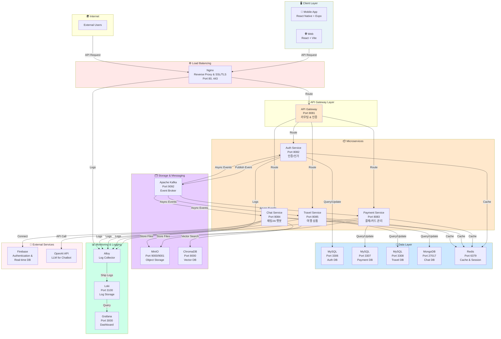
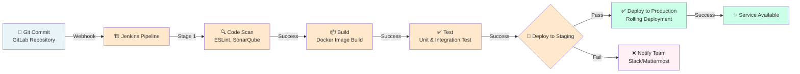
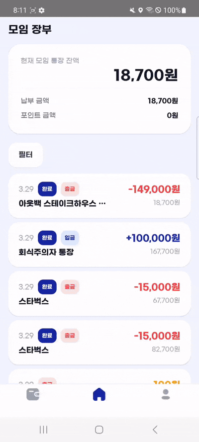
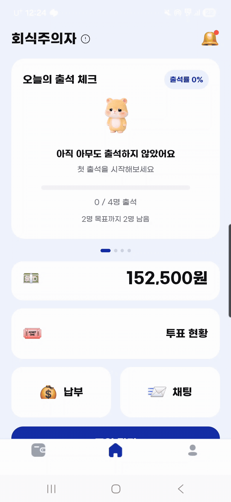
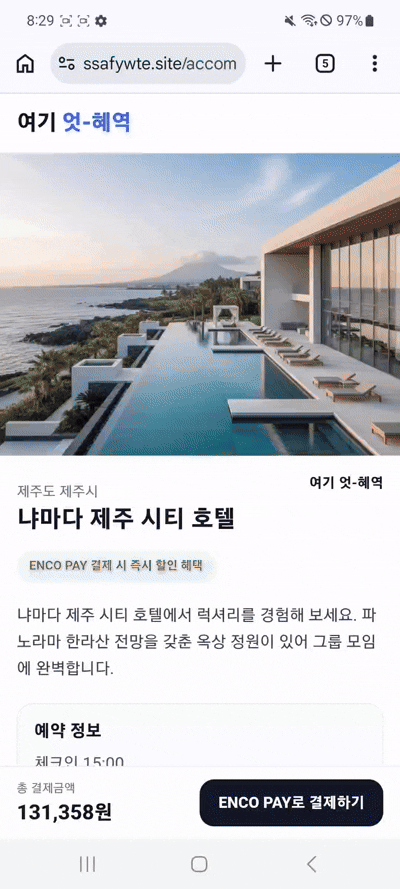

<div align="center">

# ENCO

</div>

## 모임을 더 안전하고 똑똑하게 관리하는 방법

### 모임관리는 **간편하게** 지출 내역은 **투명하게**

- **개발 기간** : 2026.02.19 ~ 2026.03.30 **(5주)**
- **플랫폼** : Fintech
- **개발 인원** : 6명 <br><br>


</div> <br>

## 🔎 목차

<div align="center">

### <a href="#developers">🌟 팀원 구성</a>

### <a href="#techStack">🛠️ 기술 스택</a>

### <a href="#systemArchitecture">🌐 시스템 아키텍처</a>

### <a href="#skills">📲 기능 구성</a>

### <a href="#feature"> 🏛️ 기능 시연</a>

### <a href="#directories">📂 디렉터리 구조</a>

</div>
<br>

## 🌟 팀원 구성

<a name="developers"></a>

<div align="center">

<table width="100%">
    <tr>
        <td width="33%" align="center" valign="bottom">
            <a href="https://github.com/ssafy14cici">
                
            </a>
        </td>
        <td width="33%" align="center" valign="bottom">
            <a href="https://github.com/ssafy14cici">
                
            </a>
        </td>
        <td width="33%" align="center" valign="bottom">
            <a href="https://github.com/ssafy14cici">
                
            </a>
        </td>
    </tr>
    <tr>
        <td width="33%" align="center" valign="top">
            <hr> <a href="https://github.com/ssafy14cici">
                <b>김윤성</b><br>(Leader & Infra & AI)
            </a>
        </td>
        <td width="33%" align="center" valign="top">
            <hr> <a href="https://github.com/ssafy14cici">
                <b>고혜역</b><br>(Frontend & Back sub & AI sub)
            </a>
        </td>
        <td width="33%" align="center" valign="top">
            <hr> <a href="https://github.com/ssafy14cici">
                <b>김내현</b><br>(Frontend Leader)
            </a>
        </td>
    </tr>
    <tr>
        <td width="33%" valign="top">
            <sub>
                - 인프라 설계 및 배포 자동화<br>
                - 시스템 아키텍처 설계<br>
                - AI 모델 통합<br>
            </sub>
        </td>
        <td width="33%" valign="top">
            <sub>
                - 프론트엔드 개발<br>
                - 백엔드 서브 개발<br>
                - AI 기능 통합<br>
            </sub>
        </td>
        <td width="33%" valign="top">
            <sub>
                - 프론트엔드 리드<br>
                - UI/UX 설계<br>
                - 모바일 최적화<br>
            </sub>
        </td>
    </tr>
</table>

<br>

<table width="100%">
    <tr>
        <td width="33%" align="center" valign="bottom">
            <a href="https://github.com/ssafy14cici">
                
            </a>
        </td>
        <td width="33%" align="center" valign="bottom">
            <a href="https://github.com/ssafy14cici">
                
            </a>
        </td>
        <td width="33%" align="center" valign="bottom">
            <a href="https://github.com/ssafy14cici">
                
            </a>
        </td>
    </tr>
    <tr>
        <td width="33%" align="center" valign="top">
            <hr>
            <a href="https://github.com/ssafy14cici">
                <b>김채아</b><br>(Frontend & Design)
            </a>
        </td>
        <td width="33%" align="center" valign="top">
            <hr>
            <a href="https://github.com/ssafy14cici">
                <b>정희수</b><br>(Backend Leader)
            </a>
        </td>
        <td width="33%" align="center" valign="top">
            <hr>
            <a href="https://github.com/ssafy14cici">
                <b>장하은</b><br>(Backend)
            </a>
        </td>
    </tr>
    <tr>
        <td width="33%" valign="top">
            <sub>
                - 프론트엔드 개발<br>
                - 디자인 시스템 구축<br>
                - 반응형 UI 구현<br>
            </sub>
        </td>
        <td width="33%" valign="top">
            <sub>
                - 백엔드 아키텍처<br>
                - 결제 시스템 개발<br>
                - 데이터베이스 설계<br>
            </sub>
        </td>
        <td width="33%" valign="top">
            <sub>
                - 채팅/AI 기능 개발<br>
                - 여행 상품 서비스<br>
                - 데이터 최적화<br>
            </sub>
        </td>
    </tr>
</table>

</div>
<br>

</div>
## 🛠️ 기술 스택

<a name="techStack"></a>

### 🌕 Frontend

<div align="center">


<br>


<br>

| **Category**  | **Stack**                                                 |
| :-----------: | :-------------------------------------------------------- |
| **Language**  | TypeScript 5.8.3                                          |
| **Framework** | React Native 0.78.0                                       |
|  **Library**  | Zustand 5.0.6, Axios 1.10.0, NativeWind, React Navigation |
|   **Tool**    | Metro Bundler, Prettier, ESLint                           |
|    **IDE**    | Visual Studio Code 1.103.1                                |

</div>

### 🌑 Backend

<div align="center">


<br>


<br>

|  **Category**  | **Stack**                                                     |
| :------------: | :------------------------------------------------------------ |
|  **Language**  | Java 17                                                       |
| **Framework**  | Spring Boot 3.5.9                                             |
|  **BE Stack**  | Spring Data JPA, Querydsl, Apache Kafka, Spring Security, JWT |
|  **Database**  | MySQL 8.0, MongoDB, Redis 7.4                                 |
| **Build Tool** | Gradle 8.14.3                                                 |
|    **IDE**     | IntelliJ IDEA 2023.3.8 (Ultimate Edition)                     |

</div>

### 🤖 AI & ChatBot

<div align="center">


<br>


<br>


<br>

|  **Category**  | **Stack**                                            |
| :------------: | :--------------------------------------------------- |
|  **Language**  | Python 3.9+                                          |
|  **Library**   | LangChain, ChromaDB, OpenAI API, Firebase            |
|  **Database**  | ChromaDB (Vector Store), Firebase Realtime DB        |
|  **Features**  | 자연어 처리 기반 모임 정보 조회, 일정 관리, FAQ 챗봇 |
| **Deployment** | Docker, Cloud Run                                    |
|    **IDE**     | Visual Studio Code                                   |

</div>

### ⚙️ Infra & DevOps

<div align="center">


<br>


<br>


<br>

#### 서버 스펙

|   **요소**   |                 **스펙**                  |
| :----------: | :---------------------------------------: |
| **Provider** |         AWS (Amazon Web Services)         |
| **Instance** | EC2 (2 instances: 4vCPUs, 16 GB RAM each) |
| **Storage**  |                SSD 320 GB                 |
|    **OS**    |            Ubuntu 24.04.3 LTS             |

<br>

#### 사용 기술 및 도구

|   **Category**    | **Stack**                                     |
| :---------------: | :-------------------------------------------- |
| **Orchestration** | Docker, Docker Compose                        |
|     **CI/CD**     | Jenkins Pipeline, GitLab                      |
| **Reverse Proxy** | Nginx                                         |
|  **Monitoring**   | Grafana, Loki, Alloy                          |
| **Data Storage**  | MinIO (Object Storage), MySQL, MongoDB, Redis |
| **Message Queue** | Apache Kafka                                  |
| **Collaboration** | GitLab, Jira, Mattermost                      |

</div>

## 🌐 시스템 아키텍처

<a name="systemArchitecture"></a>

### System Architecture



### 시스템 구성 요소

| 계층              | 컴포넌트            | 설명                        | 포트       |
| :---------------- | :------------------ | :-------------------------- | :--------- |
| **Client**        | React Native / Expo | 모바일 클라이언트           | -          |
| **Client**        | React + Vite        | 웹 클라이언트 (쇼핑몰)      | -          |
| **Load Balancer** | Nginx               | 리버스 프록시, SSL/TLS 종단 | 80, 443    |
| **API Gateway**   | API Gateway         | 요청 라우팅, 인증, 로깅     | 8081       |
| **Auth**          | Auth Service        | JWT 토큰, 권한 관리         | 8082       |
| **Payment**       | Payment Service     | 결제 처리, 카드 관리        | 8083       |
| **Chat**          | Chat Service        | 실시간 채팅, AI 챗봇        | 8084       |
| **Travel**        | Travel Service      | 여행 상품 추천, 상품 관리   | 8085       |
| **Database**      | MySQL (Auth)        | 사용자/인증 데이터          | 3306       |
| **Database**      | MySQL (Payment)     | 결제/카드 데이터            | 3307       |
| **Database**      | MySQL (Travel)      | 여행 상품 데이터            | 3308       |
| **Database**      | MongoDB             | 채팅 메시지 저장            | 27017      |
| **Cache**         | Redis               | 세션, 캐시 관리             | 6379       |
| **Storage**       | MinIO               | 파일/이미지 저장 (S3 호환)  | 9000, 9001 |
| **Messaging**     | Apache Kafka        | 비동기 이벤트 처리          | 9092       |
| **Vector DB**     | ChromaDB            | 벡터 임베딩 저장 및 검색    | 8000       |
| **Monitoring**    | Grafana             | 로그 시각화 대시보드        | 3000       |
| **Logging**       | Loki                | 로그 저장소                 | 3100       |
| **Log Collector** | Alloy               | Docker 로그 수집            | -          |
| **External**      | Firebase            | 실시간 DB, 인증             | -          |
| **External**      | OpenAI API          | LLM 기반 챗봇               | -          |

### Data Flow (데이터 흐름)

```
1️⃣ 클라이언트 요청
   Mobile/Web App → Nginx → API Gateway → Microservice

2️⃣ 인증/권한 검증
   API Gateway → Auth Service → JWT Validation → Redis Cache

3️⃣ 비즈니스 로직 처리
   - 동기: Service → Database (MySQL/MongoDB) → Response
   - 비동기: Service → Kafka → Event Consumer → Database 업데이트

4️⃣ 캐싱 전략
   자주 조회하는 데이터 → Redis에 저장 → 빠른 응답 시간

5️⃣ 파일 저장
   업로드 파일 → MinIO → S3 호환 API → 클라이언트에 URL 반환

6️⃣ 로그 수집 및 모니터링
   서비스 로그 → Alloy → Loki → Grafana 대시보드
```

### CI/CD Pipeline



### Event Notification

<div align="center">

<table>
  <tr>
    <td align="center" width="50%"><b>❌ Jenkins Pipeline Failure</b></td>
    <td align="center" width="50%"><b>✅ Jenkins Pipeline Success</b></td>
  </tr>
  <tr>
    <td align="center"></td>
    <td align="center"></td>
  </tr>
</table>

</div>

<br>

## 📲 기능 구성

<a name="skills"></a>

### 💰 주요 기능 (Key Features)

#### 1️⃣ 투명한 모임 자산 관리

- **🧾 증빙 기반 지출 기록**: 영수증 등 증빙 자료를 기반으로 모든 지출을 투명하게 기록
- **📄 내역 간편 문서화**: 복잡한 거래 내역을 클릭 한 번으로 간편하게 문서화(PDF/CSV)
- **📊 통계 시각화**: 모임 자금의 흐름과 카테고리별 지출 현황을 한눈에 파악하는 대시보드

#### 2️⃣ 스마트한 회비 및 정산 프로세스

- **🔍 납부 상태 시각화**: 구성원별 회비 납부 현황을 실시간 그래프와 리스트로 공유
- **🔔 미납자 자동 알림**: 정해진 납부일에 맞춰 미납자에게 푸시 알림 및 자동 리마인더 발송
- **🔄 All-in-One 관리**: 계획 수립부터 실제 결제, 정산, 결과 공유까지 앱 내에서 전 과정 관리

#### 3️⃣ 커뮤니케이션 & 지능형 서비스

- **💬 모임 전용 채팅**: 모임원 간의 원활한 소통과 의사결정을 위한 실시간 채팅 환경
- **🤖 스마트 챗봇**: 자산 내역 조회, 일정 관리, 자주 묻는 질문을 해결해 주는 전용 챗봇
- **⚙️ 자동화 워크플로우**: n8n을 활용한 지출 승인 및 알림 자동화 파이프라인 구축

#### 4️⃣ 데이터 기반 금융 솔루션

- **🛍️ 맞춤형 상품 추천**: 모임의 거래 규모와 소비 패턴을 분석하여 최적의 금융 상품 추천
- **📈 지출 패턴 분석**: 과거 데이터를 기반으로 다음 모임의 예상 비용 및 최적 예산 제안

#### 5️⃣ 보안 및 인증

- **🔐 안전한 권한 관리**: JWT 기반 인증과 모임별 접근 권한 분리로 데이터 보안 강화
- **🛡️ 거래 이력 추적**: 모든 지출 내역의 수정/삭제 이력을 투명하게 관리하여 신뢰도 확보

## 🏛️ 기능 시연

<a name="feature"></a>

### 🎬 기능 시연

<div align="center">

<table>
  <tr>
    <td align="center" width="25%"><b>1️⃣ 대시보드</b></td>
    <td align="center" width="25%"><b>2️⃣ 장부 조회</b></td>
    <td align="center" width="25%"><b>3️⃣ 장부 내보내기</b></td>
    <td align="center" width="25%"><b>4️⃣ 회비 납부</b></td>
  </tr>
  <tr>
    <td align="center"></td>
    <td align="center"></td>
    <td align="center"></td>
    <td align="center"></td>
  </tr>
  <tr>
    <td align="center" width="25%"><b>5️⃣ 온라인 결제</b></td>
    <td align="center" width="25%"><b>6️⃣ 오프라인 결제</b></td>
    <td align="center" width="25%"><b>7️⃣ 모임 관리</b></td>
    <td align="center" width="25%"><b>8️⃣ 숙소 추천</b></td>
  </tr>
  <tr>
    <td align="center"></td>
    <td align="center"></td>
    <td align="center"></td>
    <td align="center"></td>
  </tr>
</table>

</div>

## 📂 디렉터리 구조

<a name="directories"></a>

### 📱 Frontend (React Native )

<details align="left">
  <summary>
    <strong>Frontend 프로젝트 구조</strong>
  </summary>

```
📦enco-frontend
 ┣ 📂src
 ┃ ┣ 📂assets                   # 이미지, 아이콘 등 정적 자산
 ┃ ┣ 📂components               # 재사용 가능한 UI 컴포넌트
 ┃ ┃ ┣ 📂common                # 헤더, 버튼, 모달 등
 ┃ ┃ ┗ 📂features              # 기능별 컴포넌트
 ┃ ┣ 📂screens                 # 화면 단위 페이지
 ┃ ┃ ┣ 📂auth                 # 로그인, 회원가입
 ┃ ┃ ┣ 📂meetup               # 모임 관련 화면
 ┃ ┃ ┣ 📂expense              # 지출 관리 화면
 ┃ ┃ ┣ 📂settlement           # 정산 화면
 ┃ ┃ ┣ 📂chat                 # 채팅 화면
 ┃ ┃ ┗ 📂profile              # 프로필 화면
 ┃ ┣ 📂navigation              # React Navigation 라우팅
 ┃ ┣ 📂services                # API 통신 서비스
 ┃ ┃ ┣ 📜authService.ts
 ┃ ┃ ┣ 📜meetupService.ts
 ┃ ┃ ┗ 📜expenseService.ts
 ┃ ┣ 📂store                   # Zustand 상태 관리
 ┃ ┣ 📂hooks                   # 커스텀 훅
 ┃ ┣ 📂types                   # TypeScript 타입 정의
 ┃ ┣ 📂utils                   # 유틸리티 함수
 ┃ ┣ 📂config                  # 환경 설정
 ┃ ┗ 📂contexts                # Context API
 ┣ 📂android                    # Android 네이티브 코드
 ┣ 📂ios                        # iOS 네이티브 코드
 ┣ 📜App.tsx                    # 앱 엔트리포인트
 ┣ 📜package.json
 ┣ 📜tsconfig.json
 ┣ 📜app.json
 ┗ 📜tailwind.config.js         # NativeWind 스타일 설정
```

</details>

### ⚙️ Backend (Spring Boot Microservices)

<details align="left">
  <summary>
    <strong>Backend 프로젝트 구조</strong>
  </summary>

```
📦enco-backend
 ┣ 📂apigateway                 # API Gateway (포트 8081)
 ┃ ┗ 📂src/main/java/...
 ┃   ┣ 📂config                # 라우팅, 인증 설정
 ┃   ┣ 📂filter                # JWT, 로깅 필터
 ┃   ┗ 📂exception             # 글로벌 예외 처리
 ┣ 📂auth                       # 인증/인가 서비스 (포트 8082)
 ┃ ┗ 📂src/main/java/...
 ┃   ┣ 📂domain
 ┃   ┃ ┣ 📂entity              # Member, Authority 등
 ┃   ┃ ┗ 📂repository          # JPA Repository
 ┃   ┣ 📂application           # 비즈니스 로직
 ┃   ┣ 📂presentation          # REST Controller
 ┃   ┣ 📂jwt                   # JWT 토큰 관리
 ┃   ┗ 📂security              # Spring Security 설정
 ┣ 📂payment                    # 결제 서비스 (포트 8083)
 ┃ ┗ 📂src/main/java/...
 ┃   ┣ 📂domain
 ┃   ┃ ┣ 📂entity              # Payment, Card 등
 ┃   ┃ ┗ 📂repository
 ┃   ┣ 📂application           # 결제 로직
 ┃   ┣ 📂presentation          # REST Controller
 ┃   ┗ 📂utils                 # 결제 API 연동
 ┣ 📂chat                       # 채팅/AI 서비스 (포트 8084)
 ┃ ┣ 📂mongo-init              # MongoDB 초기화 스크립트
 ┃ ┗ 📂src/main/java/...
 ┃   ┣ 📂domain
 ┃   ┃ ┣ 📂document            # MongoDB Document
 ┃   ┃ ┗ 📂repository          # MongoRepository
 ┃   ┣ 📂application           # 채팅 및 AI 로직
 ┃   ┣ 📂presentation          # WebSocket, REST
 ┃   ┗ 📂ai                    # AI 챗봇 연동
 ┣ 📂travel                     # 여행 상품 서비스 (포트 8085)
 ┃ ┗ 📂src/main/java/...
 ┃   ┣ 📂domain
 ┃   ┃ ┣ 📂entity              # TravelProduct, Recommendation
 ┃   ┃ ┗ 📂repository
 ┃   ┣ 📂application           # 상품 추천 로직
 ┃   ┗ 📂presentation          # REST Controller
 ┣ 📜docker-compose-local.yml   # 로컬 개발 환경
 ┣ 📜Dockerfile                 # 각 서비스별 도커 이미지
 ┗ 📜.gitignore

```

</details>

### 🌐 Shopping Mall (React + Vite)

<details align="left">
  <summary>
    <strong>쇼핑몰 프로젝트 구조</strong>
  </summary>

```
📦enco-shopping-mall/ut-hyeyeok
 ┣ 📂src
 ┃ ┣ 📂components              # React 컴포넌트
 ┃ ┣ 📂pages                   # 페이지 컴포넌트
 ┃ ┣ 📂services                # API 서비스
 ┃ ┣ 📂styles                  # Tailwind CSS
 ┃ ┣ 📂hooks                   # 커스텀 훅
 ┃ ┣ 📂utils                   # 유틸리티 함수
 ┃ ┗ 📜App.tsx
 ┣ 📂public                     # 정적 자산
 ┣ 📜vite.config.ts            # Vite 설정
 ┣ 📜tsconfig.json
 ┣ 📜package.json
 ┣ 📜tailwind.config.js
 ┣ 📜Dockerfile
 ┣ 📜nginx.conf                 # Nginx 설정
 ┗ 📜deploy-shopping-mall.sh    # 배포 스크립트
```

</details>

---

## 🚀 Getting Started

### Prerequisites

- **Node.js** 22.0+
- **Java** 17
- **Docker** & **Docker Compose**
- **MySQL** 8.0
- **MongoDB**
- **Redis** 7.4
- **npm** 또는 **yarn**

### Installation & Running

#### 1️⃣ Frontend (React Native)

```bash
cd enco-frontend
npm install

```

#### 2️⃣ Backend (Docker Compose)

```bash
cd enco-backend

# 로컬 개발 환경 시작
docker-compose -f docker-compose-local.yml up -d

# 각 마이크로서비스 빌드 및 실행
cd apigateway
./gradlew bootRun

# 다른 터미널에서 각 서비스 실행
cd ../auth && ./gradlew bootRun
cd ../payment && ./gradlew bootRun
cd ../chat && ./gradlew bootRun
cd ../travel && ./gradlew bootRun
```

#### 3️⃣ Shopping Mall (React + Vite)

```bash
cd enco-shopping-mall/ut-hyeyeok

npm install
npm run dev

# 빌드
npm run build

# 프로덕션 서버
npm run preview
```

#### 4️⃣ Production Deployment (AWS EC2)

```bash
# 서버 접속
ssh -i your-key.pem ubuntu@your-ec2-ip

# 배포 디렉터리 준비
mkdir -p /home/ubuntu/{apigateway,auth,payment,chat,travel}
mkdir -p /home/ubuntu/{minio,chroma,backend-infra}
mkdir -p /home/ubuntu/nginx
mkdir -p /home/ubuntu/secrets

# 도커 네트워크 생성
docker network create app-net
docker network create monitoring

# 서비스 시작
cd /home/ubuntu/backend-infra
docker-compose up -d

# 각 마이크로서비스 배포
cd /home/ubuntu/apigateway
docker-compose up -d
```

### Environment Variables

#### Frontend (.env)

```bash
EXPO_PUBLIC_API_URL=http://localhost:8081/api
EXPO_PUBLIC_ENV=development
```

#### Backend (application.yml)

**Auth Service:**

```yaml
spring:
  datasource:
    url: jdbc:mysql://mysql:3306/auth_db
    username: root
    password: your_password
  data:
    redis:
      host: redis
      port: 6379
  kafka:
    bootstrap-servers: kafka:9092
```

**Chat Service:**

```yaml
spring:
  data:
    mongodb:
      uri: mongodb://mongo:27017/chat_db
    redis:
      host: redis
      port: 6379
  kafka:
    bootstrap-servers: kafka:9092
```

**Payment Service:**

```yaml
spring:
  datasource:
    url: jdbc:mysql://mysql:3307/payment_db
    username: root
    password: your_password
  servlet:
    multipart:
      max-file-size: 10MB
```

**Travel Service:**

```yaml
spring:
  datasource:
    url: jdbc:mysql://mysql:3308/travel_db
    username: root
    password: your_password
```

---

## 📝 주요 기술적 특징

### 🔐 보안

- **JWT 기반 인증**: 모든 API 엔드포인트는 JWT 토큰으로 보호
- **Spring Security**: 역할 기반 접근 제어 (RBAC) 구현
- **SSL/TLS**: Nginx를 통한 HTTPS 통신 암호화
- **데이터 암호화**: 민감한 정보는 AES 암호화 적용

### 🚀 성능 최적화

- **API Gateway**: 모든 요청을 중앙화하여 로드 밸런싱 및 라우팅 최적화
- **캐싱 전략**: Redis를 활용한 자주 조회하는 데이터 캐싱
- **데이터베이스 최적화**: 적절한 인덱싱과 쿼리 최적화
- **비동기 처리**: Kafka를 통한 이벤트 기반 비동기 처리
- **모바일 최적화**: React Native로 iOS/Android 네이티브 성능 제공

### 🤖 AI/ML

- **자연어 처리 챗봇**: OpenAI API와 LangChain을 활용한 지능형 챗봇
- **벡터 데이터베이스**: ChromaDB를 통한 문맥 기반 정보 검색
- **추천 시스템**: 사용자의 소비 패턴을 분석하여 맞춤형 금융 상품 추천
- **실시간 학습**: 사용자 상호작용으로부터 지속적인 모델 개선

### 📊 데이터 파이프라인

- **이벤트 기반 아키텍처**: Apache Kafka를 통한 느슨한 결합 구조
- **다중 데이터베이스**: 목적에 맞는 최적의 DB 선택
  - MySQL: 트랜잭션 데이터
  - MongoDB: 유연한 스키마 (채팅 데이터)
  - Redis: 캐시 및 세션 관리
- **로깅 및 모니터링**: Loki + Grafana를 통한 실시간 로그 수집 및 대시보드

### 🎨 Frontend 특징

- **Cross-Platform**: React Native로 iOS/Android 동시 지원
- **NativeWind**: Tailwind CSS 기반의 일관된 스타일링
- **State Management**: Zustand를 활용한 간단하고 효율적인 상태 관리
- **반응형 UI**: 모든 화면 크기에 최적화된 레이아웃

### 🔄 DevOps & CI/CD

- **컨테이너화**: 모든 서비스가 Docker로 패키징
- **자동 배포**: Jenkins Pipeline을 통한 자동 빌드/테스트/배포
- **버전 관리**: GitLab을 통한 코드 버전 관리
- **무중단 배포**: Rolling deployment로 서비스 가용성 유지

---

<div align="center">

## 🎉 Thank You!

**ENCO** | 모임을 더 안전하고 똑똑하게 관리하는 방법

---

**© 2026 ENCO Team. All rights reserved.**

</div>
